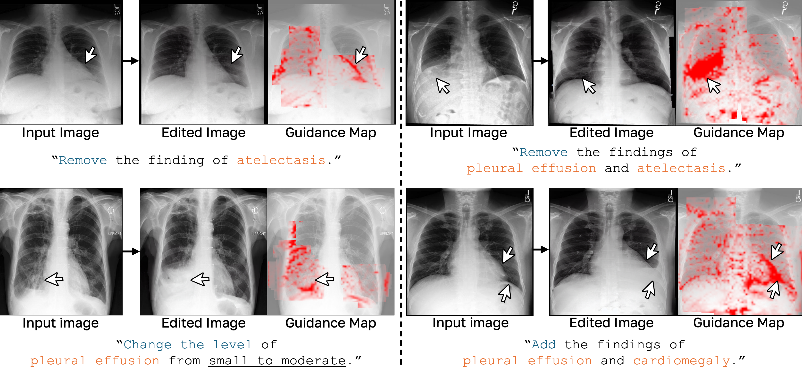
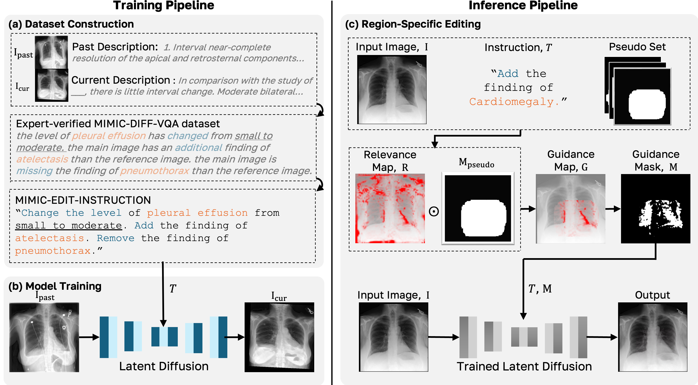

# InstructX2X: An Interpretable Local Editing Model for Counterfactual Medical Image Generation

**MICCAI 2025 (Oral Presentation)**

[Paper](<link-to-your-paper>) | [GitHub](https://github.com/hgminn/InstructX2X)

This repository is the official implementation for **InstructX2X**. Our work addresses critical limitations in counterfactual medical image generation by preventing unintended modifications and providing inherent interpretability.

**InstructX2X** introduces a novel **Region-Specific Editing** method that restricts generative modifications to specific regions of interest. This prevents collateral changes to unrelated features (e.g., demographic attributes) and produces an interpretable **Guidance Map** as a visual explanation of the editing process. To train our model, we also present **MIMIC-EDIT-INSTRUCTION**, a new dataset derived from expert-verified medical VQA pairs.

## Generation example

*Examples showing InstructX2X’s editing capabilities. Each case includes input image, edited result, and guidance map visualization (red overlay) showing modified regions.*

## Installation

First, create and activate the conda environment using the provided `environment.yaml` file.

```bash
# Create the conda environment
conda env create -f environment.yaml

# Activate the environment
conda activate ix2x
```

## Pretrained Model and Dataset

Our pretrained checkpoint is publicly available for download. To access the **MIMIC-EDIT-INSTRUCTION** dataset, please submit the following request form. This is to ensure compliance with the original data's usage policies.

| Component                  | Access                                                                                      | Notes                                                                                                                  |
| :------------------------- | :------------------------------------------------------------------------------------------ | :--------------------------------------------------------------------------------------------------------------------- |
| **InstructX2X Checkpoint** | [Google Drive](https://drive.google.com/drive/folders/1DcW93YkJPIzrP8wTimZV4CU2QNCpD_KE?usp=sharing) | Place the downloaded checkpoint file in the `models/diffusers/` directory.                                                  |
| **MIMIC-EDIT-INSTRUCTION** | [Request Access (Google Form)](https://docs.google.com/forms/d/e/1FAIpQLSdJ74gHITzRolPIXy41ZmxoVhVmP3cOW97DXI7duuMjWa5YZg/viewform?usp=header)                                | Access will be granted after the form is reviewed. Unpack and place the dataset files into the `dataset/` directory. |

## Inference

Once the model and dataset are in place, you can perform an edit on an image using the `inference/example_x2x.py` script. This script applies our **Region-Specific Editing (RSE)** method, which utilizes pre-computed pseudo-masks located in `inference/masks/` to ensure edits are localized and accurate.

```bash
python inference/example_x2x.py 
```

-----

## Training from Scratch

If you wish to train the model from scratch, follow these steps.

### 1\. Download Base Model

Our model is fine-tuned from a pretrained InstructPix2Pix checkpoint. Download the base checkpoint by running:

```bash
bash scripts/download_ip2p.sh
```

This script will download the base model and place it in the appropriate directory.

### 2\. Train the Model

With the dataset in place and the base model downloaded, start training using the `train/main.py` script.

```bash
# Example training command for a multi-GPU setup
CUDA_VISIBLE_DEVICES=0,1,2,3,4,5,6,7 \
python train/main.py \
  --name Scratch \
  --base train/configs/train_x2x.yaml \
  --train \
  --gpus 0,1,2,3,4,5,6,7 \
```

Adjust the `--gpus` argument to match your hardware configuration.

-----

## Method Overview

### Overview of Framework

*Overview of our InstructX2X framework, including dataset construction, model training, and the region-specific editing pipeline.*

### Dataset Construction

To avoid the clinical inaccuracies that can arise from LLM-generated descriptions, we repurpose the expert-verified **MIMIC-Diff-VQA** dataset. We developed a rule-based method to convert VQA descriptions of temporal changes into a structured set of editing instructions. These instructions are categorized into three primary operations: **Add**, **Remove**, and **Change the level** of a finding. This process resulted in the **MIMIC-EDIT-INSTRUCTION** dataset.

### Region-Specific Editing (RSE)

Our RSE method ensures that edits are applied only to relevant areas. This is achieved by generating a **Guidance Map ($G$)** that combines two key components:

1.  A **Relevance Map ($R$)**, derived from the model's attention to identify regions that need modification based on the text instruction.
2.  An anatomically-aware **Pseudo Mask ($M\_{pseudo}$)**, created by aggregating expert-annotated bounding boxes from the MS-CXR dataset.

The final guidance map is the element-wise product of these two maps:
$$G = M_{pseudo} \odot R_{x,I,T}$$
This map is then thresholded to create a binary mask that confines the diffusion model's denoising process, ensuring edits are both precise and interpretable.

-----

## Repository Structure

```
├── dataset/                # Location for the MIMIC-EDIT-INSTRUCTION dataset
├── environment.yaml        # Conda environment configuration
├── inference/              # Scripts and configs for running inference
│   ├── configs/
│   ├── masks/              # Pre-computed pseudo-masks for pathologies
│   └── rse_x2x.py          # Main inference script for Region-Specific Editing
├── models/                 # Model checkpoints and architecture files
│   ├── ckpt/               # Pretrained checkpoints are stored here
│   └── stable_diffusion/
├── train/                  # Scripts and configs for training
│   ├── configs/
│   └── main.py
└── README.md
```

-----

## Acknowledgements

This work builds upon the excellent foundation provided by the [InstructPix2Pix](https://github.com/timothybrooks/instruct-pix2pix) project. We also thank the creators of the MIMIC-CXR, MIMIC-Diff-VQA, and MS-CXR datasets for making their valuable data publicly available.

-----

## Citation

If you find our work useful, please consider citing our paper:

```bibtex
@inproceedings{min2025instructx2x,
  title={InstructX2X: An Interpretable Local Editing Model for Counterfactual Medical Image Generation},
  author={Min, Hyungi and You, Taeseung and Lee, Hangyeul and Cho, Yeongjae and Cho, Sungzoon},
  booktitle={International Conference on Medical Image Computing and Computer-Assisted Intervention (MICCAI)},
  year={2025}
}
```

```
```